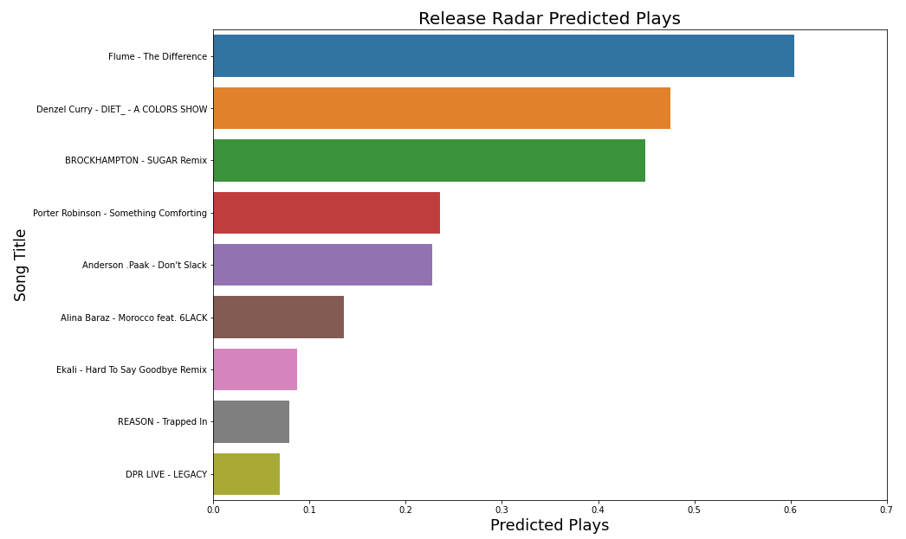

## Welcome!

On this page, I've laid out for you my favorite data science and analytics projects. I had a lot of fun working on these projects and I hope you have fun browsing through them. Through these projects, you'll get a taste of my data science experience and learn a little about me along the way as I shamelessly expose my taste in music and unhealthy obsession with basketball. 

Enjoy!

<details>
  <summary>Click me</summary>
  
  ### Heading
  1. Foo
  2. Bar
     * Baz
     * Qux

  ### Some Code
  ```js
  function logSomething(something) {
    console.log('Something', something);
  }
  ```
</details>


## [Spotify Reccomendation Model](https://github.com/BrandonJChan/Spotify_Reccomendation_Model)
<p align="center">
  
</p>

I developed a personalized Spotify song reccomendation model using the [Spotify Web API](https://developer.spotify.com/documentation/web-api/) to pull my spotify listening history and audio features for every song.

Softwares used: Python (scikit-learn, pandas, numpy), Jupyter Notebooks

<details>
  <summary>Read more</summary>
  
 
  
- **The Data** - 5,094 unique songs I listened to in a four-month period
  
  
- **The Features** - each song's popularity and Spotify audio feature values (danceability, energy, loudness, etc.)
  
- **The Goal** - Predicting the the number of times I would play a new song 

- I optimized the hyperparameters for K-Nearest Neighbors, Ridge, Random Forest, and various Ensemble Regressors, and assessed all of their performance on predicting plays
  
- I evaluated real-world performance of my reccomendation model by calculating predicted plays from my "Release Radar" playlist, a Spotify-generated playlist     containing recently-released songs
  
- Based on how much I love these songs (go bless your ears and listen to The Differnce RIGHT NOW), I would say I've succeeded :)
  
</details>

<p align="center">
  
</p>

     

<div align="center">
  Songs with highest predicted plays. I LOVE these songs.
</div>

---
<br/><br/><br/>

## [Clustering With PCA and K-means](https://github.com/BrandonJChan/clustering_pca_kmeans/blob/master/Clustering%20With%20PCA%20and%20K-means%20Presentation%20Slides.pdf)

I performed a cluster analysis on the Principal Componenets calculated from NBA player tracking statistics.

Softwares used: R (tidyverse, ggplot2)

<details>
  <summary>Read more</summary>
  
 * **The Data** - NBA data tracking every single play that every single player participated in for the entire 2017-2018 NBA season
 * **The Features** - The frequencies with which every player participated in every type of play
 * **The Goal** - Use Principal Components Analysis to quantify which types of plays differentiate NBA players the most, then apply K-means clustering to the Principal Components to visualize groupings and redefine basketball positions in the era of positionless basketball.

* The play that seperates NBA players the most is the pick and roll. The first Principal Component puts pick and roll ball handlers and pick and roll screen setters on the opposite ends of the biplot. The first Principal Component is what separates dunk contest champion Zach Lavine from dominant paint defender Tyson Chandler.

<br/>

</details>

<div align="center">
  NBA Player Statistics PCA Biplot With Clusters
</div>

<p align="center">
  
</p>

---
<br/><br/><br/>

## [Human Trafficking Victim Resource Web Application](https://github.com/BrandonJChan/Human_Traffic_Resource_App)
<br/>


I developed an R Shiny web application to help local human trafficking victims and law enforcement locate and contact services that provide shelter, counseling, medical assistance, legal assistance, etc.

Softwares used: R (Shiny, tidyverse)

<details>
  <summary>Read more</summary>

- Services are displayed on a map of the local San Luis Obispo area
- Available services can be filtered by location, type of service, and victim profile specialization
- Contact and descriptive information are shown in a table below the map and upon clicking on a service

</details>

<br/><br/><br/>

## [Fake News Detection](https://htmlpreview.github.io/?https://github.com/BrandonJChan/Fake_Headline_Detection/blob/main/Fake%20News%20Final%20Report.html)
<br/>
<p align="center">
  
</p>

I optimized a classification model that categorizes news headlines from 2015 to 2018 as fake or real.
Softwares used: R (caret, tidyverse)

<details>
  <summary>Read more</summary>

 * **The Data** - 44,689 news headlines from 2015 to 2018
 * **The Features** - Derived training and testing datasets by calculating TF-IDF values for the top 1000 most frequent words among all headlines
 * **The Goal** - Optimize an NLP classification algorithm to accurately predict whether or not a news article is real or fake based on just its headline
 
- I evaluated the performance of nine different models ranging in complexity from Logistic Regression and Classification Trees all the way to Random Forest and Neural Networks.
- The best performing model was the Support Vector Machine, with a test accuracy of 87.75% and an area under the ROC curve of 95%.
- As shown by the word clouds, headlines mentioning videos (key words "video" and "watch") were the biggest indicator of fake headlines. Headlines stating a quote (key word "says") were the biggest indicator of real headlines.

</details>

<br/>

<p align="center">
  
</p>

<div align="center">
  Most frequent words in real (left) and fake (right) headlines
</div>
